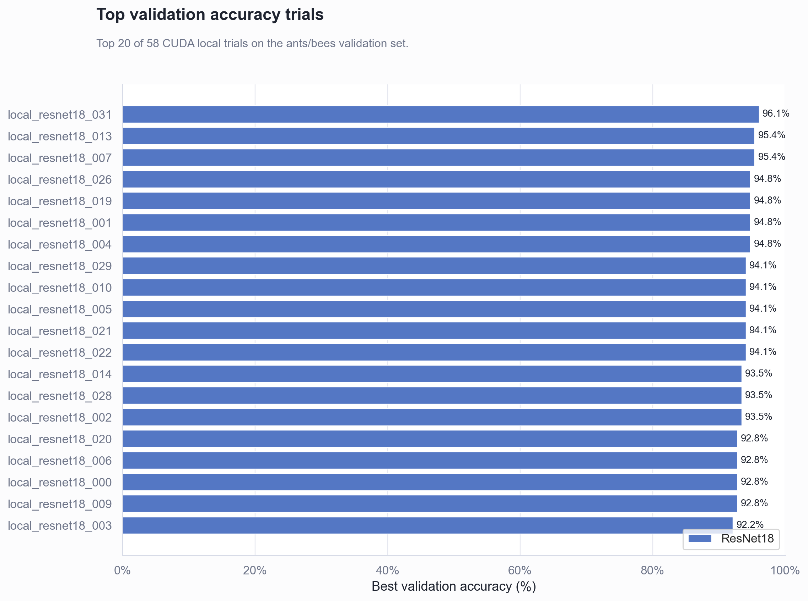
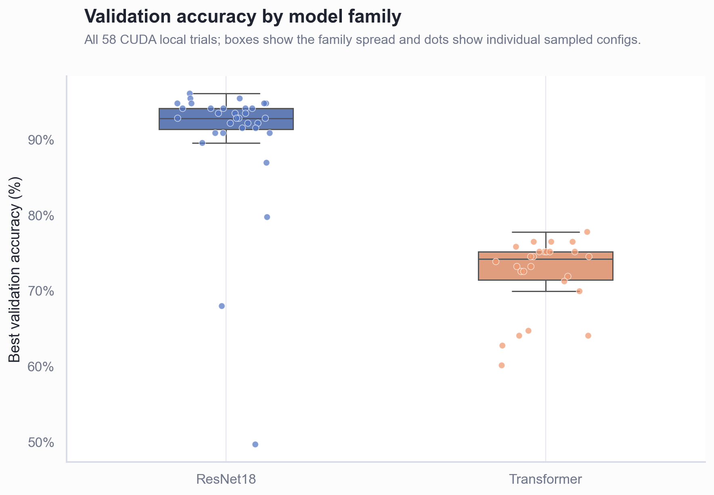
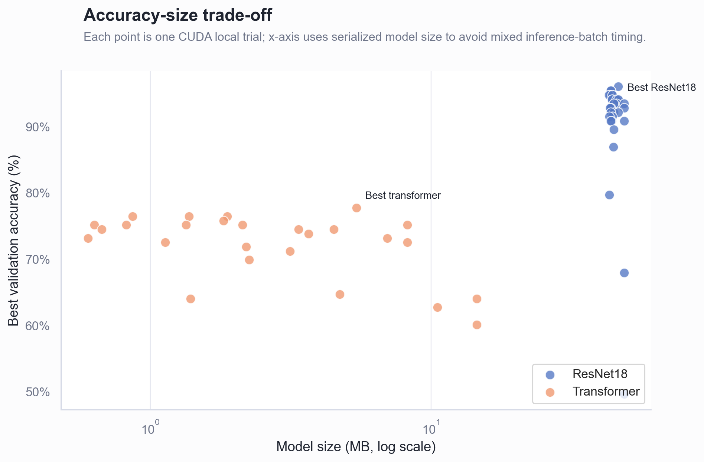

# Week 4 Report

## Executive Summary

- **The final CUDA overnight run supports the original hypothesis more strongly than the earlier Ray run.** A pretrained `ResNet18` is still the best choice for the small ants/bees dataset: the best run reached `96.08%` validation accuracy, while the best compact transformer reached `77.78%`.
- **The evidence base is now broader and cleaner.** The final comparison uses `58` completed local CUDA trials: `32` ResNet18 transfer-learning trials and `26` compact transformer trials, all saved in `results_cuda_overnight.csv`.
- **The transformer family is smaller, but the accuracy gap is too large.** The best transformer is about `5.42 MB`, compared with `46.47 MB` for the best ResNet18, but it trails by `18.30` percentage points on validation accuracy.
- **The best practical next step is to keep ResNet18 and validate the winning region.** The best configuration uses `SGD`, learning rate `0.0005`, a wide two-layer `GELU` head, label smoothing, and three unfrozen backbone blocks.

## Hypothesis

The dataset is the PyTorch ants/bees image dataset with `244` training images and `153` validation images. My hypothesis was that transfer learning with a pretrained convolutional network would outperform a compact transformer trained from scratch. With only a few hundred images, pretrained ImageNet features should already encode useful edges, textures, and object parts, while the transformer has to learn most visual structure from a very small dataset.

Inside the ResNet family, I expected the best models to come from tuning the classifier head and the unfreezing depth rather than from treating the backbone as a fully trainable network from the start.

## Experimental Design

The final run used the `overnight` preset in `hypertune.py`, executed through the local CUDA backend after Ray worker processes proved unreliable on this Windows machine. The same script still keeps the Ray backend, but the completed evidence for this report comes from the local CUDA run because it finished reliably and saved every trial.

The final experiment used:

1. `32` sampled `ResNet18` transfer-learning configurations.
2. `26` sampled compact transformer configurations.
3. `224x224` input images.
4. `20` training epochs per sampled configuration.
5. A fresh local MLflow SQLite database during experimentation, kept out of the public repository because the report and CSV exports are the reviewable evidence.

The ResNet search varied learning rate, dropout, classifier head width/depth, batch norm, activation, optimizer, batch size, unfreezing depth, weight decay, and label smoothing. The transformer search varied those optimization and head settings plus patch size, embedding dimension, depth, and attention heads.

I did not use a heatmap. The assignment warns against misleading heatmaps when search runs are not directly comparable. Instead, the report uses ranked trial accuracy, a model-size trade-off view, and a family-level accuracy distribution.

## ResNet18 Clearly Wins On Accuracy

The strongest run was `local_resnet18_031`, with `96.08%` validation accuracy and validation loss `0.2536`. Its configuration was:

| Setting | Value |
| --- | --- |
| Model | `ResNet18` transfer learning |
| Learning rate | `0.0005` |
| Optimizer | `sgd` |
| Batch size | `8` |
| Head | `768` units, `2` layers |
| Activation | `gelu` |
| Dropout | `0.0` |
| Unfrozen backbone blocks | `3` |
| Weight decay | `0.0001` |
| Label smoothing | `0.05` |

Figure 1 shows the top `20` trials from the final CUDA run. All top positions are ResNet18 configurations. That matters more than the single best run: the model family is not winning because of one lucky sample, it occupies the whole top of the ranking.

## The Family Gap Is Large, Not Marginal

Across the full sweep, ResNet18 averaged `90.44%` validation accuracy, while the transformer family averaged `72.17%`. The best transformer, `local_transformer_024`, reached `77.78%`; that is useful progress over the earlier transformer result, but still far behind the best ResNet18.

| Family | Trials | Best validation accuracy | Mean validation accuracy | Median validation accuracy |
| --- | ---: | ---: | ---: | ---: |
| `ResNet18` | `32` | `96.08%` | `90.44%` | `92.81%` |
| `Transformer` | `26` | `77.78%` | `72.17%` | `73.86%` |

Figure 2 makes the difference visible: most ResNet18 runs sit above `90%`, while the transformer runs cluster in the low-to-mid `70%` range. There are a few weak ResNet samples, but they are outliers from the sampled hyperparameter space rather than the family norm.

## Smaller Models Are Not Enough Here

The transformer family does win on compactness. The best transformer has about `1.42M` parameters and a serialized model size of about `5.42 MB`. The best ResNet18 has about `12.16M` parameters and a serialized size of about `46.47 MB`.

Figure 3 shows the trade-off. The transformers are much smaller, but they do not reach the accuracy region where the ResNet18 trials cluster. In this assignment context, accuracy is the primary metric, so the smaller transformer is not a better default despite being cheaper.

I treat the CPU inference timings as directional rather than central evidence. During the resume fix, the timing measurement was made more memory-safe, so model size is the cleaner efficiency comparison across the full `58` rows.

## Interpretation

The result fits the theory. On a small image dataset, a pretrained convolutional backbone already brings a strong visual representation. The classifier head and unfreezing depth then decide how well that representation adapts to ants versus bees. The compact transformer has fewer parameters and can be fast, but it is learning the visual representation mostly from scratch, which is a poor match for this data size.

The winning ResNet configuration is also plausible. It uses a wide head, `GELU`, label smoothing, and partial unfreezing. That combination gives the model enough capacity to adapt without turning the full network into a high-variance training problem. The optimizer result is narrower: `SGD` won in this sampled run, but I would not claim `SGD` is generally better than `AdamW`. The safer conclusion is that `SGD` is competitive in this tuned ResNet region.

## Conclusion and Next Step

The final conclusion is clear: `ResNet18` transfer learning is the right default for this ants/bees classifier. The final CUDA run improved the best validation accuracy from the earlier `93.46%` Ray result to `96.08%`, and it did so with a larger `58`-trial evidence base.

The next step would be a short confirmation run around the best ResNet region: fixed `ResNet18`, `SGD`, `lr` around `0.0005`, head width `512-768`, `GELU`, label smoothing around `0.05`, and unfreezing `2-3` backbone blocks. That would test whether the winning region is stable rather than only the best sampled point.

The final chapter evidence is saved in the [CUDA overnight results](./results_cuda_overnight.csv), [best config](./best_config_cuda_overnight.json), [search script](./hypertune.py), [shared tuning helpers](./tuning_common.py), and [instructions](./instructions.md).

[Go back to Homepage](../README.md)
